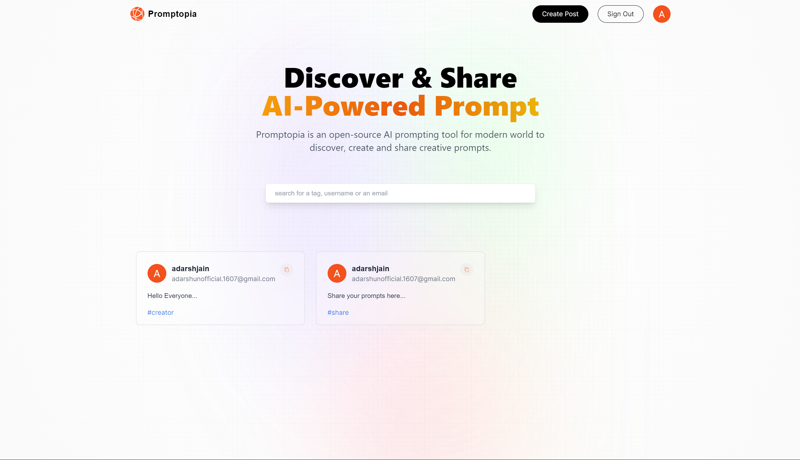
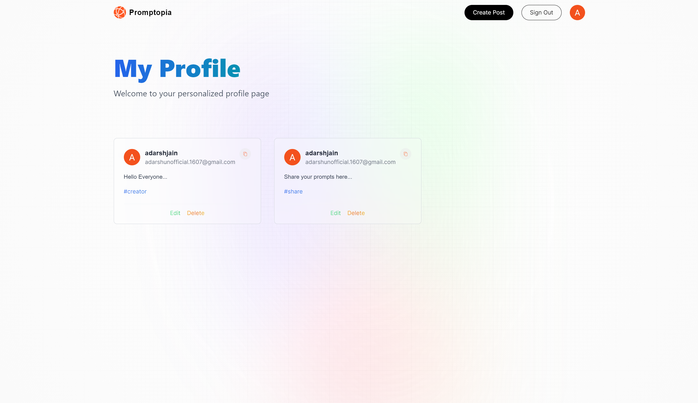
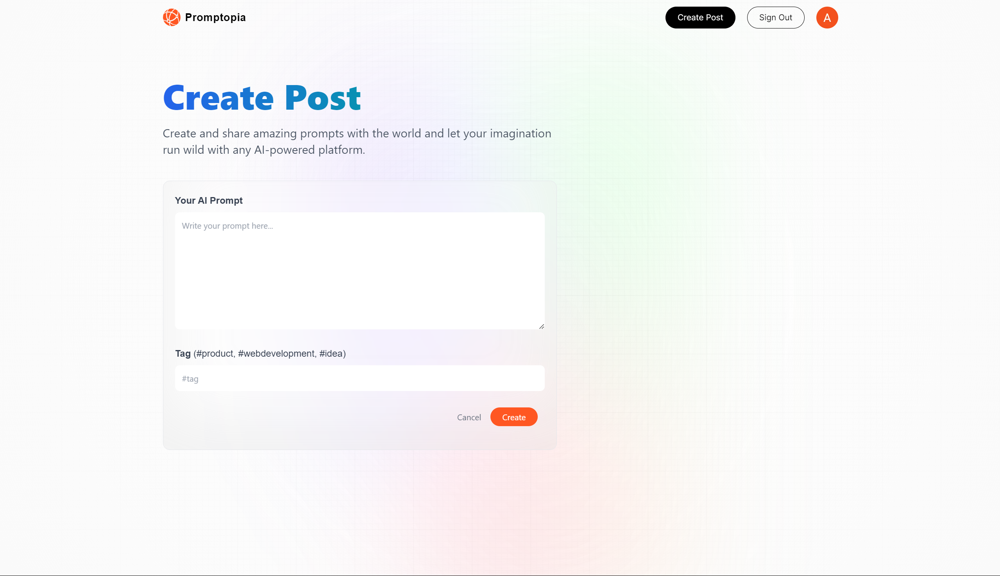

# Promptopia

## Discover & Share AI-Powered Prompt

### Promptopia is an open-source AI prompting tool for modern world to discover, create and share creative prompts.

#### Home Page of the Promptopia Project...

#### Profile Page of the Promptopia Project...

#### Create Post Page of the Promptopia Project...

 
 
 
 
 

## Credits

This project was created with inspiration from the following YouTube video:

- [Build and Deploy a Full Stack App Using the Official React Framework](https://youtu.be/wm5gMKuwSYk?si=dsD-JS9pV6kOfw83) by [JavaScript Mastery](https://www.youtube.com/@javascriptmastery)

I would like to thank JavaScript Mastery for the valuable insights and guidance provided in the video.
